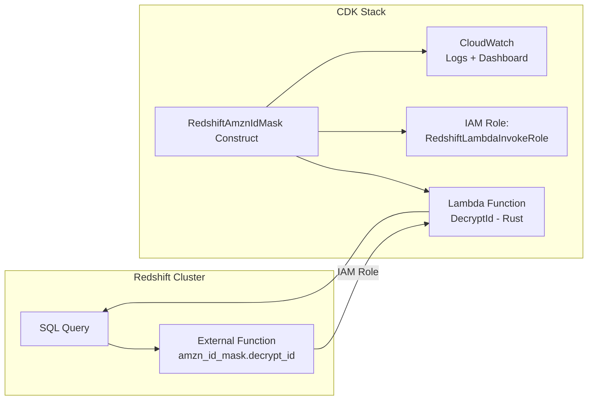
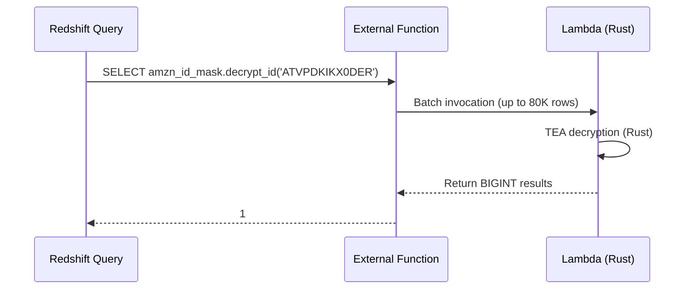

# Detailed Design: Migrate RedshiftAmznIdMask Python UDFs to Lambda UDFs

## Overview

Migrate the `decrypt_id` Python Redshift UDF on the `address-service-prod` cluster (AWS account `AddressService-Tier2-NA`, `420331918018`, `us-east-1`) to a Rust-based Lambda UDF using BDT's `RedshiftAmznIdMaskCDKConstructs` CDK construct. This resolves the Policy Engine risk before the June 30, 2026 Python UDF end-of-support deadline.

## Detailed Requirements

1. **Replace Python UDF with Lambda UDF**: The `decrypt_id` function (and related ID masking functions) must continue to work transparently for all existing queries after migration.
2. **Zero downtime**: The swap must happen during a low-utilization maintenance window with a tested rollback path.
3. **Same schema and function names**: New Lambda UDFs must be created in the `amzn_id_mask` schema with identical function names so downstream queries require no changes.
4. **Resolve PE risk**: After migration, rename old Python UDFs so they no longer trigger the 30-day usage detection.
5. **Complete before June 15, 2026**: Avoid Sev2 escalation.
6. **Infrastructure as Code**: All new resources provisioned via CDK, deployed through the existing AddressService pipeline.

## Architecture Overview



### Data Flow



## Components and Interfaces

### 1. CDK Construct Integration

Add `RedshiftAmznIdMask` construct to the AddressService CDK stack:

```typescript
import { RedshiftAmznIdMask, ApplicationLogLevel } from '@amzn/redshift-amzn-id-mask-cdk-constructs';
import { Vpc, SecurityGroup } from 'aws-cdk-lib/aws-ec2';

new RedshiftAmznIdMask(this, 'AddrSvcProd', {
  cluster: 'address-service-prod',
  clusterType: 'provisioned',
  databaseName: '<discovered_database>',
  vpc: Vpc.fromVpcAttributes(this, 'IdMaskVpc', {
    vpcId: '<discovered_vpc_id>',
    availabilityZones: ['<az1>', '<az2>'],
    privateSubnetIds: ['<subnet1>', '<subnet2>'],
  }),
  securityGroups: [SecurityGroup.fromSecurityGroupId(this, 'IdMaskSG', '<discovered_sg_id>')],
  enableIdFunctions: true,
  enableShipmentIdFunctions: false,
  enableRmaIdFunctions: false,
  logLevel: ApplicationLogLevel.INFO,
});
```

**Design Decision**: Only enable ID functions (`encrypt_id`/`decrypt_id`) since the policy engine shows only `decrypt_id` is used. This minimizes the resource footprint (2 Lambdas instead of 6). Shipment/RMA functions can be enabled later if needed.

### 2. Lambda Functions (Provisioned by Construct)

| Function | Purpose | Runtime |
|---|---|---|
| `RedshiftAmznIdMask-AddrSvcProd-EncryptId` | Encrypt customer IDs | Rust (provided.al2023) |
| `RedshiftAmznIdMask-AddrSvcProd-DecryptId` | Decrypt customer IDs | Rust (provided.al2023) |

- Memory: 512 MB (default)
- Timeout: 30s (default)
- Architecture: x86_64
- Deployed in same VPC as Redshift cluster

### 3. IAM Role

`RedshiftAmznIdMask-AddrSvcProd-RedshiftLambdaInvokeRole`:
- Trust policy: Redshift service
- Permissions: `lambda:InvokeFunction` on the two Lambda functions
- Attached to `address-service-prod` cluster

### 4. Redshift External Functions

Created via SQL from CloudFormation outputs:

```sql
CREATE SCHEMA IF NOT EXISTS amzn_id_mask;
GRANT USAGE ON LANGUAGE EXFUNC TO PUBLIC;

CREATE OR REPLACE EXTERNAL FUNCTION amzn_id_mask.encrypt_id(typetag VARCHAR, id BIGINT)
RETURNS VARCHAR STABLE
LAMBDA 'RedshiftAmznIdMask-AddrSvcProd-EncryptId'
IAM_ROLE '<role_arn>';

CREATE OR REPLACE EXTERNAL FUNCTION amzn_id_mask.decrypt_id(encrypted_id VARCHAR)
RETURNS BIGINT STABLE
LAMBDA 'RedshiftAmznIdMask-AddrSvcProd-DecryptId'
IAM_ROLE '<role_arn>';

CREATE OR REPLACE EXTERNAL FUNCTION amzn_id_mask.decrypt_id_safe(encrypted_id VARCHAR)
RETURNS BIGINT STABLE
LAMBDA 'RedshiftAmznIdMask-AddrSvcProd-DecryptId'
IAM_ROLE '<role_arn>';

GRANT EXECUTE ON ALL FUNCTIONS IN SCHEMA amzn_id_mask TO PUBLIC;
```

## Data Models

No data model changes. The functions operate on the same input/output types:
- `encrypt_id(VARCHAR, BIGINT) → VARCHAR`
- `decrypt_id(VARCHAR) → BIGINT`
- `decrypt_id_safe(VARCHAR) → BIGINT` (returns NULL on invalid input)

## Error Handling

| Scenario | Behavior | Mitigation |
|---|---|---|
| Lambda timeout | Redshift query fails with external function error | 30s timeout is generous; monitor CloudWatch |
| Lambda throttling | Redshift retries automatically | Default concurrency (1000) is shared; monitor |
| Invalid input to decrypt_id | Lambda returns error, query fails | Use `decrypt_id_safe` for graceful NULL handling |
| VPC connectivity loss | Lambda cannot be invoked | NAT Gateway + security group validation pre-deployment |
| Rollback needed | Rename old Python UDFs back | Only viable until June 30, 2026 |

## Testing Strategy

### Pre-Migration Validation
1. Discover VPC configuration (subnets, security groups, NAT gateway)
2. Validate CDK synthesis (`cdk synth`)
3. Deploy to test/beta environment first if available

### Post-Deployment Validation
1. **Functional tests**: Verify known encrypt/decrypt pairs
   ```sql
   SELECT amzn_id_mask.encrypt_id('A', 1); -- Expected: ATVPDKIKX0DER
   SELECT amzn_id_mask.decrypt_id('ATVPDKIKX0DER'); -- Expected: 1
   ```
2. **Side-by-side comparison**: Compare old Python UDF output vs new Lambda UDF output on sample data
3. **Edge cases**: NULL handling, empty strings, max BIGINT values
4. **Performance**: Batch test with 10K+ rows to confirm throughput

### Migration Validation
1. Confirm old Python UDFs are renamed (not dropped)
2. Confirm new external functions resolve correctly
3. Run existing production queries against new functions
4. Monitor CloudWatch for errors in first 24 hours

## Appendices

### A. Technology Choices

| Choice | Rationale |
|---|---|
| RedshiftAmznIdMaskCDKConstructs | BDT's official paved road; handles Lambda packaging, IAM, monitoring |
| Only ID functions enabled | Minimizes blast radius; only `decrypt_id` is actively used |
| VPC deployment (default) | Cluster is in private subnet; required for Enhanced VPC Routing |
| Rename (not drop) old UDFs | Preserves rollback path; Redshift blocks new Python UDF creation |

### B. Alternative Approaches Considered

1. **Manual Lambda deployment without CDK construct**: Rejected — more effort, no monitoring, no paved road support
2. **Deploy all 6 functions**: Viable but unnecessary overhead for current usage; can enable later
3. **Use Kiro CLI guided setup**: Good for interactive setup but we want IaC in the pipeline

### C. Key Constraints

- Python UDF execution suspended June 30, 2026 — hard deadline
- Cannot create new Python UDFs (Redshift blocks this)
- Construct ID must be ≤ 27 characters (`AddrSvcProd` = 11 chars ✓)
- Lambda functions deployed in same VPC as Redshift cluster
- IAM role attachment to cluster is additive (won't affect existing roles)

### D. Cost Estimate

- ~$0.10 per billion records processed (Lambda invocations)
- CloudWatch logs: minimal (ONE_DAY retention default)
- No additional Redshift costs
